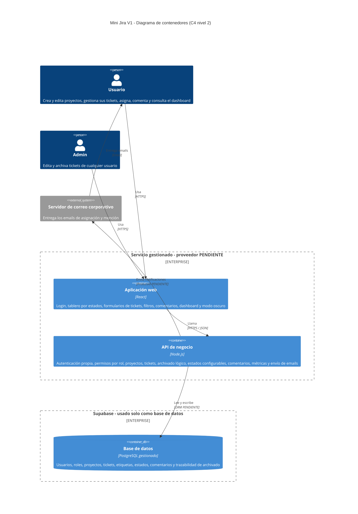
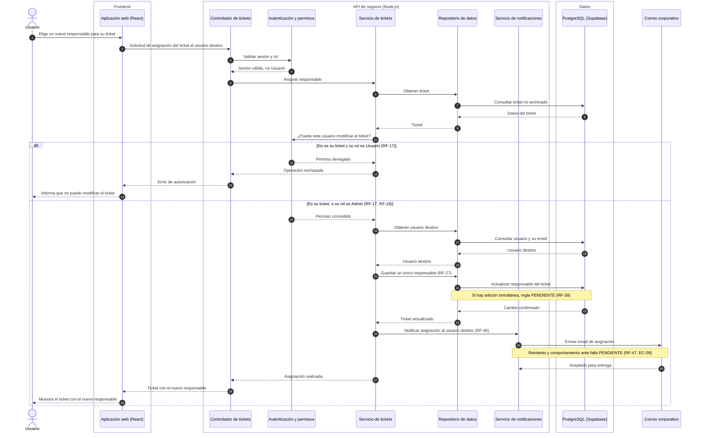

# Arquitectura: Mini Jira (V1)

| Campo | Valor |
|---|---|
| Fuentes | `docs/specs.md` v1.1, `docs/adr/001-database-selection.md` y `docs/backlog.md` |
| Fecha | 23-09-2026 |
| Autora | Isis Silva |

**Reglas de este documento**

- Los contenedores salen solo del stack (specs.md, sección 3) y de los RF. No se agregan colas, cachés, servicios de reportes ni proveedores de identidad externos, porque specs.md no los pide.
- Lo que specs.md deja abierto se marca como `[PENDIENTE]`.

---

## 1. HLD: modelo C4 de contenedores

### 1.1 Por qué existe cada contenedor

| Contenedor | Tecnología | Justificación en specs.md |
|---|---|---|
| Aplicación web | React | Stack (sección 3, SUP-03); tablero (RF-33); formulario (RF-53); filtros (RF-37); modo oscuro (RF-52) |
| API de negocio | Node.js | Stack (sección 3, SUP-03); login propio (RF-01); permisos por rol (RF-17, RF-18, RF-21, RF-22); dashboard (RF-48) |
| Base de datos | PostgreSQL gestionado en Supabase | Decisión D-01 y ADR-001; borrado lógico con trazabilidad (RF-20, RF-23) |
| Límite "Supabase" | Solo base de datos | ADR-001: no se usan su autenticación, su API autogenerada ni sus funciones |
| Servidor de correo corporativo | Sistema externo | Ya existe (R-P13); emails de asignación y mención (RF-46) |
| Límite "Servicio gestionado" | Proveedor [PENDIENTE] | R-P10, con posibles restricciones de TI (RSK-03) |

### 1.2 Decisiones que se tomaron explícitamente

- **Sin proveedor de identidad externo.** La autenticación vive en la API, porque se eligió login propio (RF-01) y se excluyó el login corporativo (sección 2.2). Tampoco se usa la autenticación de Supabase (ADR-001).
- **Sin servicio de reportes separado.** Las métricas del dashboard (RF-48) las calcula la API con consultas SQL sobre PostgreSQL.
- **Sin cola de mensajes.** specs.md no la pide. Si el envío de emails debe reintentarse cuando falla el servidor de correo, se decide en RF-47 / EC-09 [PENDIENTE].

---

## 2. LLD: diagrama de secuencia de HU-06 (asignar un responsable)

**Por qué esta historia:** es la que recorre toda la arquitectura en un solo flujo. Incluye sesión autenticada (RF-01), permisos por rol (RF-17, RF-18), una regla de dominio (un solo responsable, RF-27), persistencia en PostgreSQL (Supabase) y el único sistema externo, el correo corporativo (RF-46). Ninguna otra historia toca los cuatro contenedores a la vez.

**Alcance del flujo:** un Usuario asigna **su propio** ticket a otra persona. Así se respeta RF-17 sin depender de RF-19 [PENDIENTE], que es la definición de "ticket propio".

### 2.1 Correspondencia con el backlog

| Paso del diagrama | Escenario del backlog |
|---|---|
| Validar sesión y rol | HU-01 |
| Permiso denegado a un Usuario sobre un ticket ajeno | EC-02 |
| Guardar un único responsable | HU-06, EC-04 |
| Enviar email de asignación | HU-11 |
| Nota de edición simultánea | EC-06 (bloqueado, RF-39) |
| Nota de fallo del correo | EC-09 (RF-47) |

### 2.2 Pendientes que afectan este diseño

| Pendiente | Qué cambia en la arquitectura cuando se resuelva |
|---|---|
| RF-39: concurrencia | Si se elige avisar del conflicto, hace falta un control de versión por ticket y un error de conflicto en la API. |
| RF-47 / EC-09: fallo del correo | Define si el envío es síncrono, como en el diagrama, o si hace falta un mecanismo de reintento. |
| RF-08: visibilidad de proyectos | Agrega una verificación de membresía en "Autenticación y permisos" y un filtro en el repositorio. |
| ORM (sección 3) | Define la tecnología concreta del "Repositorio de datos". |
| Proveedor del servicio gestionado para la aplicación web y la API (R-P10) | Define el despliegue, la conectividad con Supabase y con el correo corporativo (RSK-03). |
