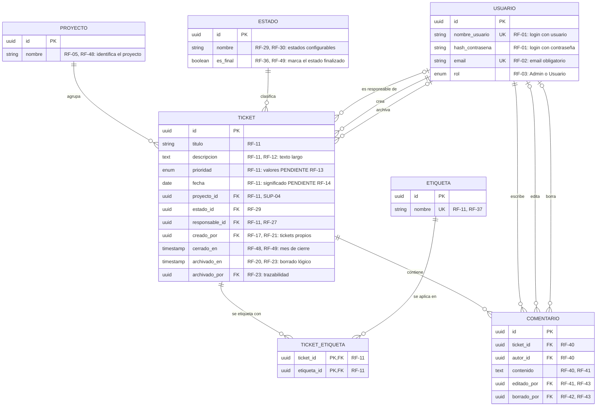

# Modelo entidad-relación: Mini Jira (V1)

| Campo | Valor |
|---|---|
| Fuentes | `docs/specs.md` v1.1 y `architecture/architecture.md` |
| Motor destino | PostgreSQL gestionado en Supabase (ADR-001) |
| Fecha | 23-09-2026 |
| Autora | Isis Silva |

**Reglas de este modelo**

- Cada entidad, atributo y relación se rastrea a un requerimiento de specs.md (ver sección 2).
- Los tipos de dato son conceptuales (`uuid`, `string`, `text`, `enum`, `date`, `timestamp`). No es SQL.
- Lo que el PRD deja abierto no se modela y aparece en la sección 3. Solo se modela lo que un requerimiento confirmado exige.

---

## 1. Diagrama

---

## 2. Trazabilidad

### 2.1 Entidades

| Entidad | Por qué existe | Fuente |
|---|---|---|
| USUARIO | Cuentas con login propio, email y rol. | RF-01, RF-02, RF-03 |
| PROYECTO | Los tickets se agrupan por proyecto, y los usuarios crean y editan proyectos. | RF-05, RF-06 |
| ESTADO | Los estados son configurables, así que deben vivir como datos y no como una lista fija en el código. | RF-29, RF-30, RF-33 |
| TICKET | Entidad central del dominio. | RF-10, RF-11 |
| ETIQUETA | "Etiquetas" es un campo del ticket y un criterio de filtro. | RF-11, RF-37 |
| TICKET_ETIQUETA | Un ticket puede tener varias etiquetas y una etiqueta puede estar en varios tickets. | RF-11 (campo en plural), RF-37 |
| COMENTARIO | Comentarios dentro del ticket que se pueden editar y borrar dejando constancia de quién lo hizo. | RF-40, RF-41, RF-42, RF-43 |

### 2.2 Atributos que requieren explicación

| Atributo | Justificación | Fuente |
|---|---|---|
| `USUARIO.rol` como atributo y no como entidad | Solo existen dos roles fijos, sin permisos configurables. | RF-03, SUP-02 |
| `USUARIO.hash_contrasena` | El login propio exige guardar la contraseña, y RNF-04 exige hacerlo de forma segura (como hash, nunca en texto plano). | RF-01, RNF-04 |
| `PROYECTO.nombre` | Es el mínimo para distinguir proyectos al agrupar y en el dashboard. El resto de atributos del proyecto no está definido. | RF-05, RF-48 |
| `ESTADO.es_final` | El dashboard cuenta como cerrados los tickets en estado finalizado, y con estados configurables hay que marcar cuál lo es. El mecanismo está [PENDIENTE RF-36]; este campo es la forma mínima de representarlo. | RF-36, RF-49 |
| `TICKET.creado_por` | RF-17 y RF-21 limitan al Usuario a sus "propios" tickets. Sin creador no se puede aplicar la regla si "propio" termina significando "creado" [PENDIENTE RF-19]. | RF-17, RF-19, RF-21 |
| `TICKET.cerrado_en` | El dashboard agrupa por el mes de cierre, no por el de creación. | RF-48, RF-49 |
| `TICKET.archivado_en` / `archivado_por` | Borrado lógico con trazabilidad. Quién y cuándo es el mínimo; si hacen falta más datos, está [PENDIENTE RF-23]. | RF-20, RF-23 |
| `COMENTARIO.editado_por` / `borrado_por` | Queda visible qué usuario editó o borró el comentario. El borrado es lógico porque, si el registro desapareciera, no se podría mostrar quién lo borró. | RF-41, RF-42, RF-43 |

### 2.3 Relaciones

| Relación | Cardinalidad | Fuente |
|---|---|---|
| PROYECTO agrupa TICKET | Un proyecto tiene 0..N tickets; un ticket pertenece a exactamente 1 proyecto. | RF-05, RF-11, SUP-04 (validar RF-09) |
| ESTADO clasifica TICKET | Un estado tiene 0..N tickets; un ticket está en exactamente 1 estado. | RF-29, RF-33 |
| USUARIO es responsable de TICKET | Un usuario es responsable de 0..N tickets; un ticket tiene 0..1 responsable. | RF-27 (una sola persona); obligatoriedad [PENDIENTE RF-15] |
| USUARIO crea TICKET | Un usuario crea 0..N tickets; un ticket tiene exactamente 1 creador. | RF-10, RF-17, RF-21 |
| USUARIO archiva TICKET | Un usuario archiva 0..N tickets; un ticket tiene 0..1 usuario que lo archivó. | RF-21, RF-22, RF-23 |
| TICKET ↔ ETIQUETA (vía TICKET_ETIQUETA) | N:M | RF-11, RF-37 |
| TICKET contiene COMENTARIO | Un ticket tiene 0..N comentarios; un comentario pertenece a exactamente 1 ticket. | RF-40 |
| USUARIO escribe COMENTARIO | Un usuario escribe 0..N comentarios; un comentario tiene exactamente 1 autor. | RF-40 |
| USUARIO edita / borra COMENTARIO | Un comentario registra 0..1 editor y 0..1 usuario que lo borró. | RF-43 |

### 2.4 Cobertura de los filtros (RF-37)

| Filtro | Atributo o relación |
|---|---|
| Fecha | `TICKET.fecha` |
| Prioridad | `TICKET.prioridad` |
| Responsable | `TICKET.responsable_id` |
| Proyecto | `TICKET.proyecto_id` |
| Etiquetas | `TICKET_ETIQUETA` |

---

## 3. Qué no se modeló y por qué

| Elemento | Motivo | Qué cambiaría al resolverse |
|---|---|---|
| Miembros de proyecto | La visibilidad por proyecto está sin definir. | Si se exige membresía: nueva entidad PROYECTO_MIEMBRO (N:M entre USUARIO y PROYECTO). [PENDIENTE RF-08] |
| Ticket en varios proyectos | Sin definir; se supuso 1 proyecto por ticket. | La relación pasaría a N:M con una tabla intermedia. [PENDIENTE RF-09, SUP-04] |
| Estados por proyecto y orden de columnas | No se sabe si los estados son globales o por proyecto, ni cómo se ordenan. | Posible `ESTADO.proyecto_id` y un atributo de orden. [PENDIENTE RF-34, RF-35] |
| Control de versión del ticket | La regla de concurrencia está sin decidir. | Si se elige avisar del conflicto: atributo de versión en TICKET. [PENDIENTE RF-39] |
| Valores de prioridad | Sin definir. | Define los valores del `enum`, o una entidad aparte si deben ser configurables. [PENDIENTE RF-13] |
| Catálogo de etiquetas | No se sabe si son libres o de un catálogo gestionado. | Puede requerir atributos de gestión en ETIQUETA. [PENDIENTE RF-16] |
| Menciones | El formato de mención está sin definir y el PRD no pide guardarlas, solo notificar. | Solo si se decide persistirlas. [PENDIENTE RF-45] |
| Notificaciones enviadas | El PRD pide enviar emails (RF-46), no guardar un historial. | Solo si RF-47 pide reintentos o seguimiento de envíos. |
| Métricas del dashboard | Se calculan a partir de TICKET, ESTADO y PROYECTO; no son datos propios. | Ninguno. |
| Fechas de creación y actualización genéricas | Ningún RF las pide (el dashboard usa `cerrado_en`). | Se agregarían si un requerimiento las exige. |
